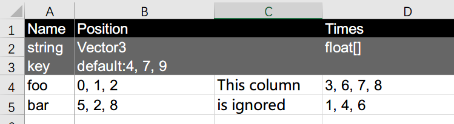
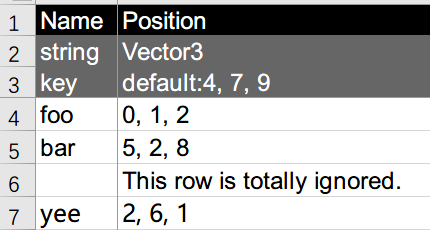
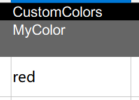
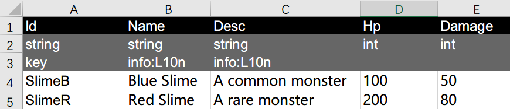

# Untitled Config Data Builder

[](http://unlicense.org/) [](https://openupm.com/packages/com.github.salyu9.untitledconfigdatabuilder/)

Lightweight config building tool for using excel sheet data in unity 3D.

Sheet data construction will be compiled to an assembly (dll) that contains several classes that can be used by user scripts.

Sheet data will be export to bytes assets in resources folder, which can be loaded and used via the assembly.

Table of contents:
<!-- @import "[TOC]" {cmd="toc" depthFrom=2 depthTo=6 orderedList=false} -->
<!-- code_chunk_output -->

- [Requirements](#requirements)
- [Installation](#installation)
- [Configuration](#configuration)
- [Basic Usage](#basic-usage)
  - [Class name](#class-name)
  - [Sheet data structure](#sheet-data-structure)
  - [Property types](#property-types)
  - [Separators](#separators)
  - [Escaping](#escaping)
  - [Flags](#flags)
  - [Recompile & auto reimport & play mode reload](#recompile-auto-reimport-play-mode-reload)
- [Advanced Usage](#advanced-usage)
  - [Custom types](#custom-types)
  - [Multi-Segment types](#multi-segment-types)
  - [Custom flag handler](#custom-flag-handler)
  - [Localization data](#localization-data)

<!-- /code_chunk_output -->

## Requirements

Unity 2019.4 ~ Unity 2021.2

⚠️ _Warning_: This package is under development and may change at any time, please use at your own risk.

⚠️ _Warning_: This tool uses [ExcelDataReader](https://github.com/ExcelDataReader/ExcelDataReader) as an editor-only plugin. If your project has another copy of ExcelDataReader dll, you can download sources of this repository, remove ExcelDataReader.dll and add this tool as a local package.

## Installation

You can install this package via OpenUPM (recommended) or git URL.

- via OpenUPM: Install this [OpenUPM Package](https://openupm.com/packages/com.github.salyu9.untitledconfigdatabuilder/)

- via Git: Add `https://github.com/salyu9/Untitled.ConfigDataBuilder.git#v0.1.13` to package manager.

## Configuration

Use "Project Settings > Config Data Builder" to modify config building settings.

- Source Folder: The folder in project assets that contains the excel files.

- Assembly Namespace: The namespace of the classes in the compiled assembly.

- Assembly Output Path: The file path of the compiled assembly. The file name will be the assembly name.

- Public Constructors: Whether the constructors of config classes are public. If true, scripts will be able to create instances of config classes.

- Flag Row Count: How many rows will be treated as flag rows.

- Data Export Type: How config data will be exported. Can be one of the values below:

  - Resources Bytes Assets

    Data will be exported to .bytes assets in a specified folder under resources folder, thus can be load using `Resources.Load`.

  - Other Bytes Assets
    Data will be exported to .bytes assets in specifed folder. User will need to manually load data from assets, using method `Load(byte[])` of config classes.

- Data Output: The path (relative to Assets/Resources if export type is "Resources Bytes Assets") of the folder which will contain exported data.

- Auto Init: Only available if using "Resources Bytes Assets" export type. The builder will generate `ConfigDataManager.Initialize()` method which load all data from resources, and call it automatically when `AllConfig()` or `FromKey()` is invoked. User can also manually call `Initialize()` before using config data.

- Localization Exporter Type: If sheet data contains localizable data, a user script class can be set to export localization source data, see [Localization data](#localization-data) section for more details.

- Custom Type Assemblies: Config data can contain custom types from user scripts. To use custom types, add the names of the assemblies that contains these types at here. See [Custom Types](#custom-types) for more details about custom types.

- Importing Assemblies: Extra assemblies that the compiled assembly should reference. Custom type assemblies will be auto imported.

## Basic Usage

This tool can read data from .xlsx files and .fods files (Libre Office plain text format). Place sheet files in this structure for example:

```text
📁Project
└───📁Assets
    ├───📁Resources
    │   └───📁ExportedData
    └───📁SourceConfigData
            My Source Data1.xlsx
            My Source Data2.xlsx
```

With settings:

```text
Source Folder: Assets/SourceConfigData
Assembly Namespace: MyProject.ConfigData
Assembly Output path: Assets/CompiledDlls/ConfigData.dll
Data Export Type: Resources Bytes Asset
Data Output: ExportedData
Auto Init: true
```

Then you can use menu "Tools > Config Data > Rebuild Config" to build the dll and export config data to project. Result in this file structure:

```text
📁Project
└───Assets
    ├───📁CompiledDlls
    │       ConfigData.dll
    │
    ├───📁Resources
    │   └───📁ExportedData
    │           Skill.bytes
    │           Unit.bytes
    │
    └───📁SourceConfigData
            My Source Data1.xlsx
            My Source Data2.xlsx
```

Reference ConfigData.dll in your assembly definitions, then you can acquire config data from code:

```csharp
using MyProject.ConfigData;

class MyBehaviour: MonoBehaviour
{
    void Start()
    {
        // Example: use Skill config
        foreach (SkillConfig config in SkillConfig.AllConfig())
        {
            Debug.Log(config);
            Debug.Log($"{config.Name} deals {config.Damage} damage.");
            SkillConfig superSkill = SkillConfig.FromName("super");
            ...
        }
    }
}
```

### Class name

File name is insignificant to this tool. You can use any valid name as your config file name.

The sheet name will be used as prefix of the class name, it should be a valid C# identifier except for keywords. For example, sheet 'Skill' will be compiled to class `SkillConfig`.

Sheet name can contain a period, informing the sheet is part of the full config data of the same config class. The part before period will be the name prefix of the class. Sheets with same name prefix must have the same structure, but can be in different files. For example: data from sheet 'Skill.1' in file 'A.xslx' and sheet 'Skill.abc' in file 'B.xslx' will be merged to data of `SkillConfig`.

A sheet that have a name begin with '(' or '（' is fully ignored. This allows user to add design-only sheet in config files, with names like '(Plans)' or '(TempData)'.

### Sheet data structure

An example sheet data looks like below:



- The first row is the name row, which defines the property names of the result class. Empty names or names begin with '(' or '（' imply ignored columns, allows design-only columns.

- The second row is the type row, which contains types of each property.

- The third row is the flag row, which contains flags of each property.

- Each of rest rows provides data of an instance of the class, representing one of config data.

### Property types

Basic types supported are:

- Basic C# types: `bool`, `short`, `ushort`, `int`, `uint`, `long`, `ulong`, `float`, `double`, `string`.

- Unity vectors: `Vector2`, `Vector3`, `Vector4`, `Vector2Int`, `Vector3Int`. Write `2, 5, 3` in data for `Vector3`. Alias for these types are available:

  - `Vector3` = `vector3` = `float3`
  - `Vector3Int` = `vector3int` = `int3`

- Unity colors: `Color` and `Color32`. Values can be 3-number rgb or 4-number rgba, e.g. `255, 0, 0, 255`. Or use html string lead by `#`, e.g. `#FF0000FF`.

- `[T]`: list of type `T` (read-only). Generates an `IReadOnlyList<T>` property in script. Data format is like `5,6,7` (of type `[float]`).

- `T[]`: array of type `T`. Generates a `T[]` property in script. Data format is the same as list. Arrays are mutable so you may accidentally modify config data shared by other scripts. Better to use `[T]` instead.

- `{TKey: TValue}`: dictionary that maps type `TKey` to type `TValue` (read-only). Generates an `IReadOnlyDictionary<TKey, TValue>` property in script. Data format is like `a: 1, b: 2` (of type `{string: int}`). Be careful not to use improper types as keys (such as lists).

- `T?`: Nullable wrapped type, such as `float?`. If data cell is blank or `null`, the value will be `null`. `T` must be struct type.

### Separators

For vectors, colors, lists, arrays, dictionaries or custom multi-segment types, the separators can be specified by flags. See [Flags](#flags) for more detail about specify separators.

The default separators for vectors/colors/lists/arrays are "`,`", And the default separators for dictionary are "`,`" and "`:`" (between a key and a value). Trailing separators is allowed.

- This introduces a problem if nullable type or string is used in array (i.e. multi-segment converter that accepts blanks). For `[int?]`, data "`1, , 2,`" will be `[1, null, 2]`. If the last `null` is required, you can explicitly use `1, , 2, null` or add an additional separator at the end.

Lists/arrays of lists/arrays (actually jagged arrays) and lists of vectors/colors will need two separators. Defaults are "`;`" for array and "`,`" for elements. For example: `1, 2, 3; 4, 5; 6` will be `[[1, 2, 3], [4, 5], [6]]`. Lists/arrays of higher dimensions are supported, but you will need to explicitly specify the separators using flags.

The format of separator flag is `separator:<sep1><sep2><sep3>...`. For example, "`separator:$;,`" can be used to specify separators for `[[[int]]]`, the data should be in format of `1, 2, 3; 4, 7 $ 8, 7; 6; 3`, which generates `[[[1, 2, 3], [4, 7]], [[8, 7], [6], [3]]]`. Separator characters count must be same as needed.

For dictionaries, `separator:<sep1><sep2><sep3><sep4>...` will use `<sep1>` as dictionary element separator, use `<sep2>` as key-value pair separator, and use `<sep3>...` for key type and then `<sepN>...` for value type separators. (Better not to use multi-segment types as keys). Separators of `{float3: [[int]]}` must contain 5 characters: the first two for dictionary, the third for `float3`, and rest for `[[int]]`.

### Escaping

Escaping using "`\`" is allowed in flags. It is useful to use `\n` as separator for complex data types. For example, by setting `separator:\n;,`, a data cell of type `[[[int]]]` can be:

```text
1,2,3; 4,5
7,8; 9,10,11
```

Which will be converted to `[[[1,2,3], [4,5]], [[7,8], [9,10,11]]]`.

### Flags

Flag row defines special handling of properties. A column (property) can have multiple flags, separated by '|'. Some flag can have a value after it with a colon. Example: `separator:# | key`.

Supported flags are listed below.

- `key`

    Indicates that value of this property is unique in this config and can be used as a dictionary key. Multiple key properties are allowed.

    A row with its key property leaved empty will be ignored.

    

    In the config class, each key property corresponds to a dictionary and a query method. For example, if 'Skill' sheet has an `int` key property 'Id' and a `string` key property 'Name', you can query config row with code like this:

    ```csharp
    SkillConfig config123 = SkillConfig.FromId(123);
    SkillConfig configABC = SkillConfig.FromName("ABC");
    ```

- `ignored`

    This property is ignored.

- `info:<info-type>`

    This property contains special information about each row. Info property will not be compiled into config class nor be exported.

    Currently the only supported `info-type` is `L10n`, which indicates that this property data should be exported as localization source data, see [Localization Data](#localization-data) for more details.

- `default:<default-value>`

    Specify the default value of this property if leaved empty.

- `separator:<separator>`

    Specify the separators used for vector/color/array/dictionary or custom multi-segment types.

- `ignore-empty`

    Indicates that array property should ignore empty segments.

### Recompile & auto reimport & play mode reload

When source files are edited and saved, Untitled Config Builder will try to reimport source files and export config data. You needn't do anything if the config class structures are not changed. If editor is in play mode, config data will also be reloaded automatically if "Auto Init" is enabled, call to `AllConfigs()` and `FromKey()` methods will reflect new changes. But config class instances won't change after acquired.

If config class structures have changed, reimporting procedure will fail with a warning reported: "Config dll types mismatch. Rebuilding config required." In this case, you should use menu "Tools > Config Data > Rebuild Config" to rebuild config assembly and reimport config data.

You can force rebuild all via "Tools > Config Data > Force rebuild Config". You can also reimport data manually using "Tools > Config Data > Reimport data".

⚠️ _Warning_: if you changed your custom types or converters, you may need to force rebuild the assembly.

## Advanced Usage

### Custom types

You can use your custom types in config data. To do so, you need define custom types in a specific assembly (via assembly definitions, see [Unity doc](https://docs.unity3d.com/Manual/ScriptCompilationAssemblyDefinitionFiles.html) for details) and add this assembly into 'Project settings > Config Data Builder > Custom Type Assemblies' settings. This assembly should reference to 'Untitled.ConfigDataBuilder.Base', and define a converter class for each custom type.

Enums in the assembly will be auto imported and become available in config data.

Below is a custom type `MyColor` example. With `MyColor` registered to config builder, you can use color names in your data cell and treat them as instances of `MyColor` in your code. In sheet data, the type name can be full name `MyCodeNamespace.MyColor` or short name `MyColor` if there's no conflicts, or aliases specified in `ConfigValueConverter` attribute (`my-color`).

```csharp
using System;
using System.IO;
using UnityEngine;
using Untitled.ConfigDataBuilder.Base;

namespace MyCodeNamespace
{
    [ConfigValueConverter(typeof(MyColorConverter), "my-color")]
    public class MyColor
    {
        public Color Color { get; }

        public MyColor(Color color)
        {
            Color = color;
        }

        public static implicit operator Color(MyColor myColor) => myColor.Color;
        public static implicit operator MyColor(Color color) => new MyColor(color);
    }

    // Converter type for MyColor, must implement IConfigValueConverter<MyColor>
    public class MyColorConverter : IConfigValueConverter<MyColor>
    {
        // Parse MyColor from config string
        public MyColor Parse(string value)
        {
            return value switch {
                "red"   => Color.red,
                "green" => Color.green,
                "blue"  => Color.blue,
                _       => throw new ArgumentOutOfRangeException(nameof(value), value, null)
            };
        }

        // Write MyColor value to exported config data
        public void WriteTo(BinaryWriter writer, MyColor value)
        {
            var color32 = (Color32)value.Color;
            writer.Write(color32.r);
            writer.Write(color32.g);
            writer.Write(color32.b);
        }

        // Read MyColor value from exported config data
        public MyColor ReadFrom(BinaryReader reader)
        {
            var r = reader.ReadByte();
            var g = reader.ReadByte();
            var b = reader.ReadByte();
            return new MyColor(new Color32(r, g, b, 1));
        }

        // Get a string that represent the value.
        // Used in config class' ToString() method.
        public string ToString(MyColor value)
        {
            return ColorUtility.ToHtmlStringRGB(value.Color);
        }
    }
}

```

Then you can use it in config data:



### Multi-Segment types

If your custom type need a separator, you can make your converter implement `IMultiSegConfigValueConverter` instead.

Below is an example for a vector-like type.

```csharp
using System;
using System.IO;
using Untitled.ConfigDataBuilder.Base;

namespace MyCodeNamespace
{
    [ConfigValueConverter(typeof(MyPointConverter))]
    public class MyPoint
    {
        public readonly int X;
        public readonly int Y;

        public MyPoint(int x = 0, int y = 0)
        {
            X = x;
            Y = y;
        }
    }

    // Converter type for MyPoint, must implement IMultiSegConfigValueConverter<MyPoint>
    public class MyPointConverter : IMultiSegConfigValueConverter<MyPoint>
    {
        // Parse MyPoint from config string
        public MyPoint Parse(string[] segs)
        {
            if (segs.Length != 2)
            {
                throw new ArgumentException($"Cannot parse '{string.Join(",", segs)}' to {nameof(MyPoint)}.");
            }
            return new MyPoint(int.Parse(segs[0]), int.Parse(segs[1]));
        }

        // Write MyPoint value to exported config data
        public void WriteTo(BinaryWriter writer, MyPoint value)
        {
            writer.Write(value.X);
            writer.Write(value.Y);
        }

        // Read MyPoint value from exported config data
        public MyPoint ReadFrom(BinaryReader reader)
        {
            var x = reader.ReadInt32();
            var y = reader.ReadInt32();
            return new MyPoint(x, y);
        }

        // Get a string that represent the value.
        // Used in config class' ToString() method.
        public string ToString(MyPoint value)
        {
            return $"<{nameof(MyPoint)} X={value.X}, Y={value.Y}>";
        }
    }
}

```

Then you can use it in your sheets:


The default separator for a custom multi-segment type is "`,`". You can assign a deferent separator in the attribute: `[ConfigValueConverter(typeof(MyPointConverter), DefaultSeparator = ';')]`.

This type can still be used in arrays or dictionaries. but be aware of separators. Better explicitly specify separators in flags.

### Custom flag handler

Flags are handled before converter creation and default value evaluation.

You can make custom flag handlers to modify properties of columns. You can modify type names, ignore specific columns, or set default value of columns, thus to change converter creating behaviour.

One of the use-cases is that you want declare some columns to be used out of unity (such as used in server). In this case you can make a flag handler to ignore columns that are marked as `server-only`:

```csharp
using Untitled.ConfigDataBuilder.Editor;

[FlagHandler("server-only")]
public class ServerOnlyFlagHandler : IFlagHandler
{
    public void HandleColumn(ColumnInfo columnInfo)
    {
        columnInfo.IsIgnored = true;
    }
}
```

Or you can make custom default values:

```csharp
[FlagHandler("dir-default")]
public class Vector3DefaultValueHandler : IFlagHandlerWithArgument
{
    public void HandleColumn(ColumnInfo columnInfo, string arg)
    {
        // Set DefaultValue will override RawDefaultValue set by 'default:<value>'
        columnInfo.DefaultValue = arg switch {
            "up"      => Vector3.up,
            "down"    => Vector3.down,
            "forward" => Vector3.forward,
            "back"    => Vector3.back,
            "left"    => Vector3.left,
            "right"   => Vector3.right,
            _         => throw new ArgumentOutOfRangeException(nameof(arg), arg, null)
        };
    }
}
```

### Localization data

It is a common use case that config contains properties that should be localized. Untitled Config Builder provides a way to integrate config data with your localization solutions. To use this feature:

- Sheet contains localization source data should have one and only one property that is marked as `key` property.

- Mark localization properties as `info:L10n`. These properties must be `string`, `[string]` or `string[]`.

- Make an exporter class that implements `Untitled.ConfigDataBuilder.Editor.IL10nExporter`. This type must be in an editor-only assembly which has reference to `Untitled.ConfigDataBuilder.Editor` asmdef.

- Add exporter class' fullname to settings.

Example sheet:



Example exporter:

```csharp
using Untitled.ConfigDataBuilder.Editor;

namespace MyProject.Editor
{
    public class JsonL10nExporter : IL10nExporter
    {
        private const string Folder = "Assets/StreammingAssets/Localization/en/";

        public void Export(IList<L10nData> l10nList)
        {
            foreach (var data in l10nList)
            {
                var jDoc = new JObject();

                foreach (var row in data.Rows)
                {
                    var key = row.Key;
                    var properties = row.Properties;

                    var jProps = new JObject();
                    foreach (var property in properties)
                    {
                        var name = property.Name;
                        var value = property.Value;
                        if (value is string str)
                        {
                            jProps.Add(name, new JValue(str));
                        }
                        else if (value is IReadOnlyList<string> strs)
                        {
                            jProps.Add(name, new JArray(strs.Cast<object>()));
                        }
                    }
                    jDoc.Add(key, jProps);
                }
                
                var jsonPath = Folder + data.SheetName + ".json";
                using var writer = new StreamWriter(jsonPath);
                var jsonWriter = new JsonTextWriter(writer)
                {
                    Formatting = Formatting.Indented
                };
                jDoc.WriteTo(jsonWriter);
            }
        }
    }
}
```

Set "Config Data Builder > Localization exporter type" to `MyProject.Editor.JsonL10nExporter`.

The exported files will contain contents like this:

```text
File: Assets/StreamingAssets/Localization/en/Monster.json
```

```json
{
  "SlimeB": {
    "Name": "Blue Slime",
    "Desc": "A common monster"
  },
  "SlimeR": {
    "Name": "Red Slime",
    "Desc": "A rare monster"
  }
}
```

The exporter will be invoked when config data are reimported. This example exporter writes localization source to json files in streaming assets folder, which can be load at runtime. You can make your own exporter and integrate to your localization solution.

- Sometimes after the config dll regeneration, script code may failed to compile due to config structure changes. The exporter type may not exists and exporting will fail. Just fix your code and do `Tools > Config Data > Reimport Data`, the localization source data will be exported.
