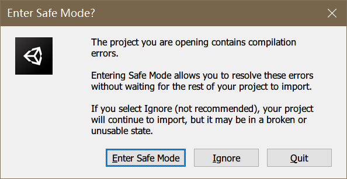

# Untitled Config Data Builder

[](https://openupm.com/packages/com.github.salyu9.untitledconfigdatabuilder/)

Lightweight config building tool for using excel sheet data in unity 3D.

Sheet data construction will be compiled to an assembly (dll) that contains several classes that can be used by user scripts.

Sheet data will be export to bytes assets in resources folder, which can be loaded and used via the assembly.

## Requirements

Unity 2019.4 ~ Unity 2021.2 (in progress)

⚠️ _Warning_: This package is under development and may change at any time, please use at your own risk.

⚠️ _Warning_: This tool uses nuget packages (ExcelDataReader, CodeAnalysis, etc.). To avoid conflicts, nuget packages' dlls are not included in this package. Instead a zip of dlls is provided for manually importing packages. Please unzip these dlls to your project, or manually download required packages from nuget and import them in case of conflicts. See installation section for more information.

## Installation

1. Install this package to your project.

    You can install this package via git URL or OpenUPM.

    - via Git: Add `https://github.com/salyu9/Untitled.ConfigDataBuilder#v0.1.2` to package manager.

    - via OpenUPM: Install this [OpenUPM Package](https://openupm.com/packages/com.github.salyu9.untitledconfigdatabuilder/)

2. Open your project with Unity Editor if not opened. You will encounter compile errors due to missing nuget packages. Click "Ignore" if this dialog appears.

    

3. Unzip the dlls from the zip file under "Packages/Untitled Config Data Builder/NugetPackages" folder to your project, Unzip netstandard_2_0.zip for Unity 2021.1 and previous versions, netstandard_2_1.zip for Unity 2021.2 and above (in progress). You can also find it using menu "Tools > Config Data > Locate Nuget Packages".

    

    If some dlls are already included in your project, try to unzip remain dlls to your project and see if they conflict. In case of conflict, you may need to manually download compatible version of required nuget packages and import them to your project.

    Packages required by this tool are:

   - ExcelDataReader (Version=3.6.0)

   - Microsoft.CodeAnalysis.CSharp (Version=3.11.0)

## Configuration

Use "Project Settings > Config Data Builder" to modify config building settings.

- Source folder: The folder in project assets that contains the excel files.

- Assembly name: The name of the compiled assembly.

- Assembly namespace: The namespace of the classes in the compiled assembly.

- Assembly output path: The file path of the compiled assembly.

- Data output: The path (relative to Assets/Resources) of the folder which will contain exported data.

- Localization exporter type: If sheet data contains localizable data, a user script class can be set to export localization source data, see #Usage section for more details.

- Custom Type Assemblies: Config data can contain custom types from user scripts. To use custom types, add the names of the assemblies that contains these types at here. See #Usage for more details about custom types.

- Importing assemblies: Extra assemblies that the compiled assembly should reference. Custom type assemblies should also be included here.

## Usage

This tool can read data from .xlsx files and .fods files (Libre Office plain text format). Place sheet files in this structure for example:

```text
📁Project
└───📁Assets
    ├───📁Resources
    │   └───📁ExportedData
    └───📁SourceConfigData
            My Source Data1.xlsx
            My Source Data2.xlsx
```

With settings:

```text
Source folder: Assets/SourceConfigData
Assembly name: MyProject.ConfigData
Assembly namespace: MyProject.ConfigData
Assembly output path: Assets/CompiledDlls/ConfigData.dll
Data output: ExportedData
```

Then you can use menu "Tools > Config Data > Rebuild Config" to build the dll and export config data to project. Result in this file structure:

```text
📁Project
└───Assets
    ├───📁CompiledDlls
    │       ConfigData.dll
    │
    ├───📁Resources
    │   └───📁ExportedData
    │           Skill.bytes
    │           Unit.bytes
    │
    └───📁SourceConfigData
            My Source Data1.xlsx
            My Source Data2.xlsx
```

Reference ConfigData.dll in your assembly definitions, then you can acquire config data from code:

```csharp
using MyProject.ConfigData;

class MyBehaviour: MonoBehaviour
{
    void Start()
    {
        // Example: use Skill config
        foreach (SkillConfig config in SkillConfig.AllConfig())
        {
            Debug.Log(config);
            Debug.Log($"{config.Name} deals {config.Damage} damage.");
            SkillConfig superSkill = SkillConfig.FromName("super");
            ...
        }
    }
}
```

### Class name

File name is insignificant to this tool. You can use any valid name as your config file name.

Sheet name will be used as prefix of the class name, it should contain only A-Z/a-z/0-9 for this tool. For example, sheet 'Skill' will be compiled to class `SkillConfig`.

Sheet name can contain a period, informing the sheet is part of the full config data of the same config class. The part before period will be the name prefix of the class. Sheets with same name prefix must have the same structure, but can be in different files. For example: data from sheet 'Skill.1' in file 'A.xslx' and sheet 'Skill.abc' in file 'B.xslx' will be merged to data of `SkillConfig`.

A sheet that have a name begin with '(' or '（' is fully ignored. This allows user to add design-only sheet in config files, with names like '(Plans)' or '(TempData)'.

### Sheet data structure

A example sheet data looks like below:


- The first row is the name row, which defines the property names of the result class. Empty names or names begin with '(' or '（' imply ignored columns, allows design-only columns.

- The second row is the type row, which contains types of each property.

- The third row is the flag row, which contains flags of each property.

- Each of rest rows provides data of an instance of the class, representing one of config data.

### Property types

Basic types supported are:

- Basic C# types: `bool`, `short`, `ushort`, `int`, `uint`, `long`, `ulong`, `float`, `double`, `string`.

- Unity types: `Vector2`, `Vector3`, `Vector4`, `Color`, `Color32`.

- Arrays of scalar types and strings are supported, such as `float[]`. Arrays of vectors or colors are not supported. Just use `float[]` in the type row.

- Dictionaries are supported if their key type and value type are both scalar types and strings(and not vectors or colors), such as `IDictionary<string, int>`, Use `{string: int}` in the type row, and write `a: 1, b: 2` in data.

- Nullable wrapped scalar type, such as `float?`.

### Custom types

You can use your custom types in config data. To do so, you need define custom types in a specific assembly (via assembly definitions, see Unity doc for details) and add this assembly into 'Project settings > Config Data Builder > Custom Type Assemblies' settings. This assembly should reference to 'Untitled.ConfigDataBuilder.Base', and define a converter class for each custom type.

Example:

```csharp
// Type you want to use in config data
using Untitled.ConfigDataBuilder.Base;

[ConfigValueConverter(typeof(MyPointConverter))]
public class MyPoint
{
    public int X;
    public int Y;

    public MyPoint(int x = 0, int y = 0)
    {
        X = x;
        Y = y;
    }
}

// Converter type for MyPoint, must implement IConfigValueConverter<MyPoint>
public class MyPointConverter : IConfigValueConverter<MyPoint>
{
    // Parse MyPoint from config string
    public MyPoint Parse(string value)
    {
        string[] segs = value.Split(',');
        if (segs.Length != 2)
        {
            throw new ArgumentException(
                $"Cannot parse '{value}' to {nameof(MyPoint)}.");
        }
        return new MyPoint(int.Parse(segs[0]), int.Parse(segs[1]));
    }

    // Write MyPoint value to exported config data
    public void WriteTo(BinaryWriter writer, MyPoint value)
    {
        writer.Write(value.X);
        writer.Write(value.Y);
    }

    // Read MyPoint value from exported config data
    public MyPoint ReadFrom(BinaryReader reader)
    {
        int x = reader.ReadInt32();
        int y = reader.ReadInt32();
        return new MyPoint(x, y);
    }

    // Get a string that represent the value.
    // Used in config class' ToString() method.
    public string ToString(MyPoint value)
    {
        return $"<{nameof(MyPoint)} X={x}, Y={y}>";
    }

    // Cannot be used in arrays/dictionaries due to separator conflict,
    // so IsScalar should return false.
    public bool IsScalar
    {
        get { return false; }
    }
}

```

Then you can use it in config data:


Custom types cannot used in arrays or dictionaries.

### Flags

Flag row defines special handling of properties. A column (property) can have multiple flags, separated by '|'. Some flag can have a value after it with a colon. Example: `separator:# | ref:Skill.Id`.

Supported flags are list below.

- `key`

    Indicates that value of this property is unique in this config and can be used as a dictionary key. Multiple key properties are allowed.

    Rows with its key property leaved empty will be ignored.

    

    In the config class, each key property corresponds to a dictionary and a query method. For example, if 'Skill' sheet has a `int` key property 'Id' and a `string` key property 'Name', you can query config row with code like this:

    ```csharp
    SkillConfig config123 = SkillConfig.FromId(123);
    SkillConfig configABC = SkillConfig.FromName("ABC");
    ```

- `ignored`

    This property is ignored.

- `info:<info-type>`

    This property contains special information about each row. Info property will not be compiled into config class nor be exported.

    Currently the only supported `info-type` is `L10n`, which indicates that this property data should be exported as localization source data, see #Localization for more details.

- `ref:<SheetName>.<KeyName>`

    Indicates that this property's value should exists in specified key column of specified sheet. When reimporting config data, rows that missing references will be reported as warnings.

- `elem-ref:<SheetName>.<KeyName>`

    Similar to `ref` but used on array properties, indicates that every element of this property should reference to specified key column.

- `default:<default-value>`

    Specify the default value of this property if leaved empty.

- `separator:<separator>`

    Specify the separator used for vector/color/array/dictionary types. Default separator is ','.

- `ignore-empty`

    Indicates that array property should ignore empty segments.

### Localization data

It is a common use case that config contains properties that should be localized. Untitled Config Builder provides a way to integrate config data with your localization solutions. To use this feature:

- Sheet contains localization source data should have one and only one property that is marked as `key` property.

- Mark localization properties as `info:L10n`. These properties must be `string` or `string[]`.

- Make a exporter class that implements `Untitled.ConfigDataBuilder.Editor.IL10nExporter`.

- Add exporter class' fullname to settings.

Example sheet:


Example exporter:

```csharp
using Untitled.ConfigDataBuilder.Editor;

namespace MyProject.Editor
{
    public class JsonL10nExporter : IL10nExporter
    {
        private const string Folder = "Assets/StreammingAssets/Localization/en/";

        public void Export(IList<L10nData> l10nList)
        {
            foreach (var data in l10nList)
            {
                var jDoc = new JObject();

                foreach (var row in data.Rows)
                {
                    var key = row.Key;
                    var properties = row.Properties;

                    var jProps = new JObject();
                    foreach (var property in properties)
                    {
                        var name = property.Name;
                        var value = property.Value;
                        if (value is string str)
                        {
                            jProps.Add(name, new JValue(str));
                        }
                        else if (value is string[] strs)
                        {
                            jProps.Add(name, new JArray(strs.Cast<object>()));
                        }
                    }
                    jDoc.Add(key, jProps);
                }
                
                var jsonPath = Folder + data.SheetName + ".json";
                using var writer = new StreamWriter(jsonPath);
                var jsonWriter = new JsonTextWriter(writer)
                {
                    Formatting = Formatting.Indented
                };
                jDoc.WriteTo(jsonWriter);
            }
        }
    }
}
```

Set "Config Data Builder > Localization exporter type" to `MyProject.Editor.JsonL10nExporter`.

The exported files will contain contents like this:

```text
File: Assets/StreamingAssets/Localization/en/Monster.json
```

```json
{
  "SlimeB": {
    "Name": "Blue Slime",
    "Desc": "A common monster"
  },
  "SlimeR": {
    "Name": "Red Slime",
    "Desc": "A rare monster"
  }
}
```

The exporter will be invoked when config data are reimported. This example exporter writes localization source to json files in streaming assets folder, which can be load at runtime. You can make your own exporter and integrate to your localization solution.

### Recompile & auto reimport & play mode reload

When source files are edited and saved, Untitled Config Builder will try to reimport source files and export config data. You needn't do anything if the construction is not changed. If editor is in play mode, config data will also be reloaded automatically, call to `AllConfigs()` and `From<Key>()` methods will reflect new changes. But config class instances won't change after acquired.

If config construction has changed, reimporting procedure will fail with a warning reported: "Config dll types mismatch. Rebuilding config required." In this case, you should use menu "Tools > Config Data > Rebuild Config" to rebuild config assembly and reimport config data.

You can force rebuild all via "Tools > Config Data > Force rebuild Config". You can also reimport data manually using "Tools > Config Data > Reimport data".
